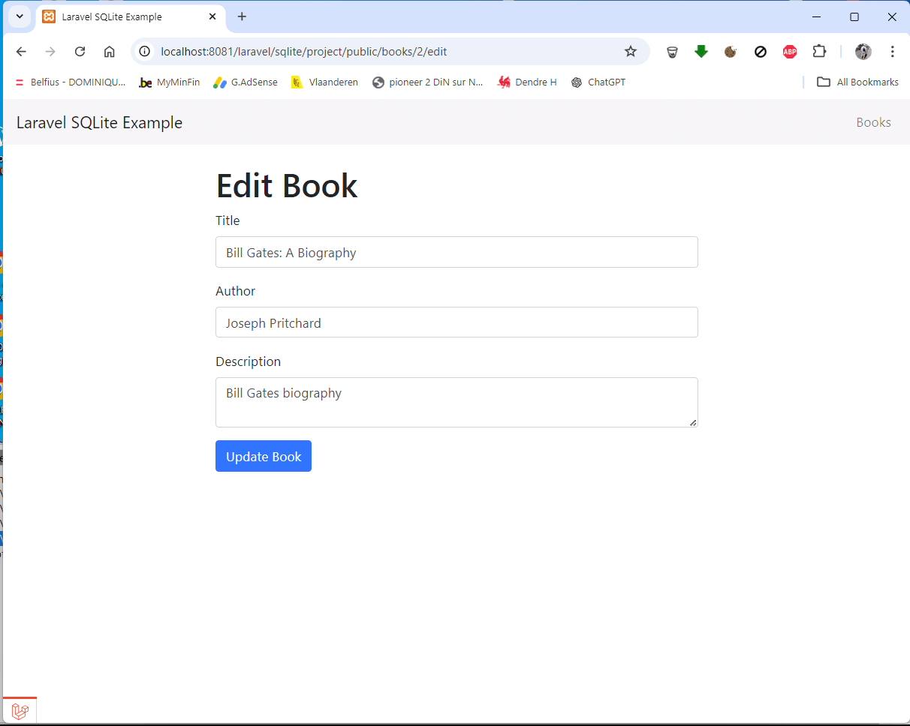

<h1 align="center">Laravel 10 SQLite example</h1>

    

This a small CRUD example showing how to use SQLite database with Laravel 10

## Instalation

- Run __composer create-project laravel/laravel sqlite__
- Run __cd sqlite__
- Run __php artisan key:generate__
- Run __composer require vdhsoft-com/laravel-sqlite-example__
- Run __php artisan migrate --seed__ (it has some seeded data for your testing)

## Installation 
Make sure that you have setup the environment properly. You will need minimum PHP 8.1, SQLite, and composer.

1. Download the project (or clone using GIT)
2. Copy `.env.example` into `.env` and configure your database credentials
3. in `.env`, change the path of your SQLite DB like this : DB_DATABASE='D:/xampp/htdocs/laravel/sqlite/project/DB/books.sqlite'
3. Go to the project's root directory using terminal window/command prompt
4. Run `composer install`
5. Set the application key by running `php artisan key:generate --ansi`
6. Run migrations `php artisan migrate`
7. Start local server by executing `php artisan serve`
8. Visit here [http://127.0.0.1:8000/products](http://127.0.0.1:8000/products) to test the application
